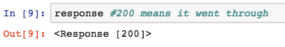

# Reading 17

### Web Scraping 
- Web scraping is a technique to automatically access and extract large amounts of information from a website, which can save a huge amount of time and effort.

- There is some legal requirements to actually web scrape certain website due to copyrigth laws.
- Don't download data from site too fast or could crash the site.

**Turning to PYthon Code:**
import following libraries:
```
import requests
import urllib.request
import time
from bs4 import BeautifulSoup
```

Then set URL to the website:
```
url = 'http://web.mta.info/developers/turnstile.html'
response = requests.get(url)
```



### Webscraping
1. [ScrapeHero](https://www.scrapehero.com/how-to-prevent-getting-blacklisted-while-scraping/)
2. [How to Webscrape](https://towardsdatascience.com/how-to-web-scrape-with-python-in-4-minutes-bc49186a8460)
3. [Wiki Webscraping](https://en.wikipedia.org/wiki/Web_scraping)
